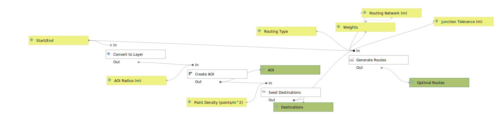

# Route_Generator
This QGIS model generates lots of routes given a weighting. 

The model was originally designed for running, so that I could find hilly routes. It effectively can find hilly out/back routes, routes which have minimal traffic, flat routes, routes with lots of traffic, etc, or any weighted combination of attributes.

NOTE: the coordinate system of the project must be in meters for the model to run successfully

